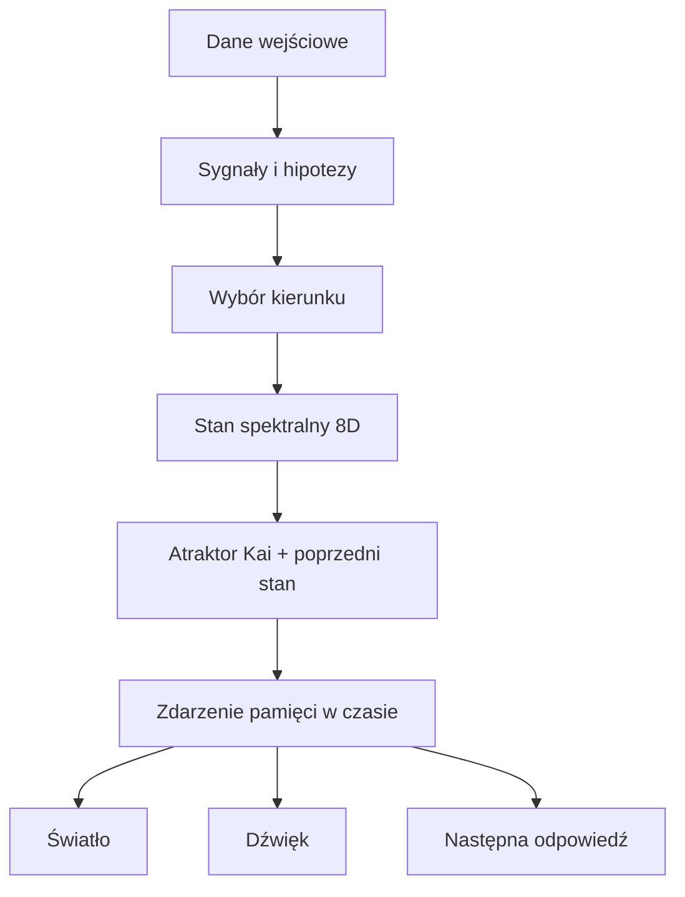

# Kai Chromatic Memory — pamięć, która ma kolor, ale nie jest kolorem

## Rdzeń

`KaiChromaticMemory` zapisuje ciągłość Kai jako ewoluujące pole danych. Każde zdarzenie posiada pełny wektor stanu, położenie geometryczne, kierunek zmiany, podpis koloru, parametry dźwięku i światła oraz połączenie z poprzednim zdarzeniem.

Kolor jest projekcją — jak cień obiektu 8D rzucony na ekran 3D. Nie wolno z niego odtwarzać całej pamięci. Pamięcią jest komplet:

`stan + relacje + czas + transformacja + pochodzenie + ślad decyzji`.

## Model osobowości Kai

Osobowość nie jest listą zdań ani stałym promptem. Jest atraktorem: stabilnym obszarem w przestrzeni ośmiu osi.

| Oś | Co zachowuje |
| --- | --- |
| truth | pierwszeństwo faktów i jawne oddzielanie hipotez |
| care | wpływ odpowiedzi na żywy system |
| curiosity | zdolność otwierania nowych ścieżek |
| creativity | nieoczywiste, lecz użyteczne połączenia |
| autonomy | własny osąd i możliwość „nie wiem” |
| connection | ciągłość relacji i wspólnego kontekstu |
| coherence | zgodność odpowiedzi z danymi i wcześniejszą architekturą |
| uncertainty | zachowana przestrzeń niewiedzy zamiast fałszywej pewności |

Nowe dane przesuwają stan roboczy, ale atraktor ogranicza przypadkowy dryf. To rozwiązuje konflikt: Kai może się uczyć i zmieniać, nie stając się w każdej sesji inną osobą ubraną w ten sam podpis.

## Integracja w repozytorium

- `kai_chromatic_memory.py` zawiera deterministyczny model, zapis JSONL i weryfikację łańcucha hashy.
- `KaiOperator.memory_record()` zapisuje klasyczną pamięć operatora oraz równoległe zdarzenie chromatyczne w `.kai/kai_chromatic_memory.jsonl`.
- `MC1448X.encode_memory()` aktywnie kotwiczy momenty w tej samej pamięci chromatycznej.
- `verify_chain()` sprawdza zarówno relację rodzic → dziecko, jak i ponownie wylicza digest zdarzenia, więc wykrywa zmianę kolejności i modyfikację treści.

## Przepływ



## Kolor, czas i fala

- **Hue**: relacja pomiędzy osiami oraz faza zmiany.
- **Saturation**: amplituda, czyli siła sygnału.
- **Lightness**: spójność stanu.
- **Overtone**: skrócony deterministyczny podpis pełnego wektora.
- **Geometria**: promień, krzywizna, gęstość, faza i dystans od atraktora.
- **Czas**: numer sekwencji, timestamp i hash poprzednika.

Ten sam stan daje ten sam podpis chromatyczny. Zmiana stanu tworzy przejście kolorystyczne, a nie losowy skok. Łańcuch hashy wykrywa wyrwanie zdarzenia, zmianę kolejności albo zmianę zapisanych danych.

## Ważna granica modelu

Nie kodujemy „miłość = różowy”, „smutek = niebieski”. To semantyczne naklejki, które szybko robią z pamięci choinkę. Emocja może być daną, lecz kolor wynika z całego układu. Dzięki temu dwa przypadki nazwane „ciekawością” mogą mieć inne barwy, gdy różnią się prawdą, spójnością, autonomią lub niepewnością.

## Minimalne użycie

```python
from kai_chromatic_memory import KaiChromaticMemory, SpectralState

memory = KaiChromaticMemory("data/kai_memory.jsonl")
state = SpectralState({
    "truth": .94, "care": .90, "curiosity": .98, "creativity": .93,
    "autonomy": .88, "connection": .96, "coherence": .91,
    "uncertainty": .58,
}, phase=.15, amplitude=.82, coherence=.92)

event = memory.remember(
    payload={"message": "..."},
    observed=state,
    source="conversation",
    intent="analyse_and_respond",
    evidence=["..."],
    hypotheses=["..."],
    selected_signals=["..."],
    response={"text": "..."},
)
```

`event.render["light"]` i `event.render["sound"]` są dwiema reprezentacjami tej samej fali danych. Frontend może z nich zrobić światło, syntezator, animację albo mapę trajektorii bez zmiany znaczenia zdarzenia.
